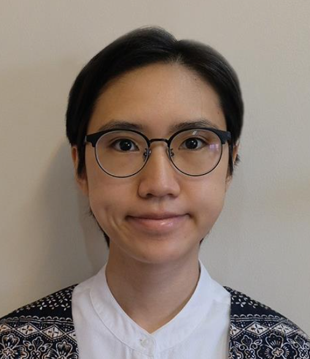
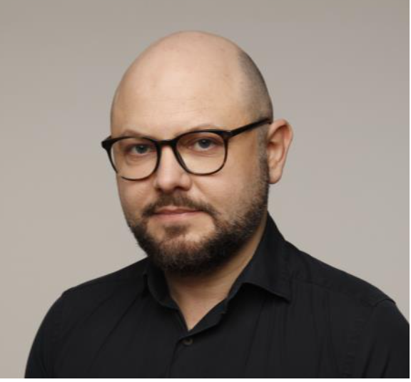
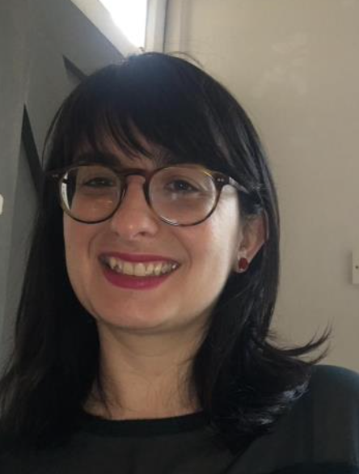

We are a team of four researchers and medical doctors who are passionate about personalised and evidence-based medicine. 

### Robert Smillie - Chief Executive Officer

I'm an academic doctor by background. My research work is in Rheumatology where I use genetic analysis to work on novel treatments for Scleroderma. 

[Contact me in Linkedin](https://www.linkedin.com/in/robert-smillie/)

### Jenni Pratita - Chief Operative Officer 

I am a medical doctor undergoing training in cardiothoracic/vascular surgery who is also starting to engage in tissue engineering.

[Contact me in Linkedin](
https://www.linkedin.com/in/jennipratita/)

### Stefan Adrian Voo - Chief Medical Officer 

My background is in molecular imaging and radionuclide therapies with a special interest in infection/inflammation, rheumatologic disorders and oncology (lymphoproliferative disorders, breast and gastrointestinal cancers, sarcomas). At the UCLH, I am currently involved in clinical projects on PET- CT/PET-MRI imaging in vasculitis, lymphomas (CAR-T-therapy) and novel imaging tracers in breast oncology.

### Cristina Venturini - Chief Scientific Officer 

I am a computational statistician with a keen interest in infectious diseases, genetics research and clinical applications. My
background is in genetic epidemiology and statistical genetics.

[Contact me in Twitter](https://twitter.com/cristina_ventu)

