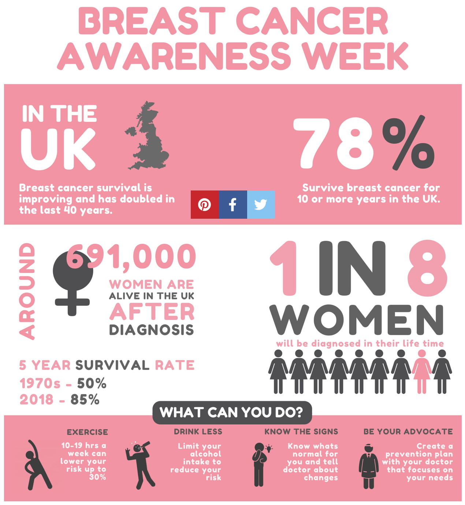
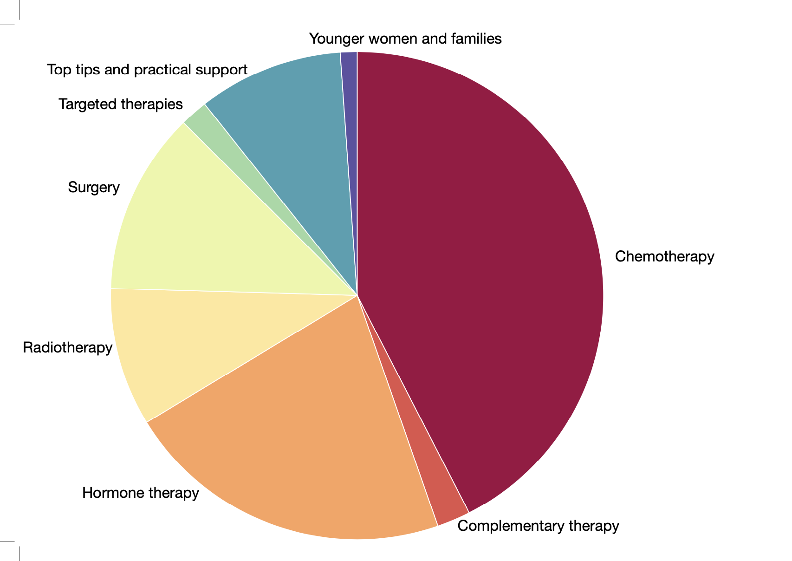
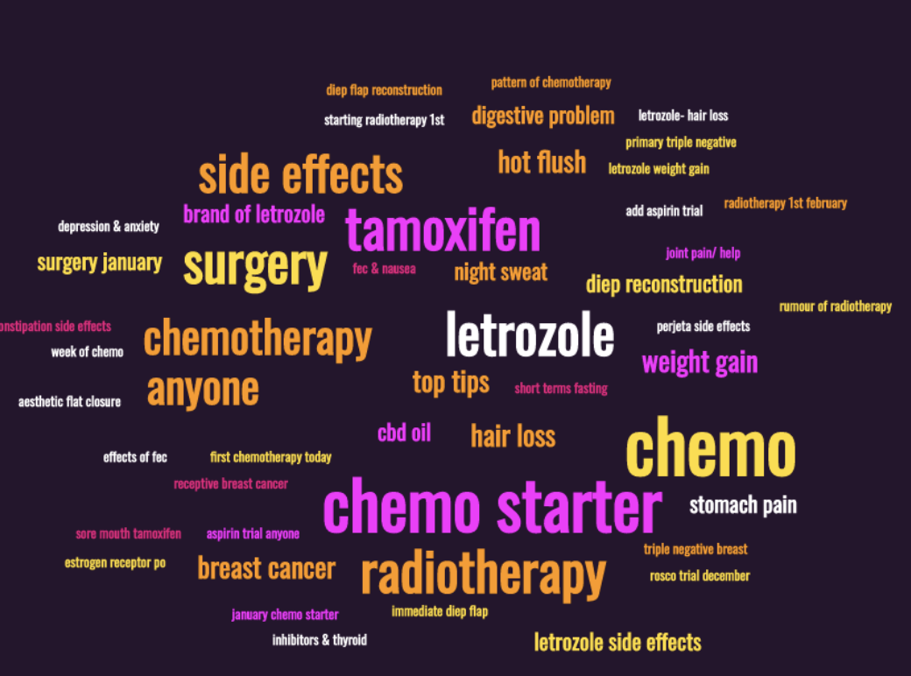

Our aim is to create a personalised nutrition service for  breast cancer patients to improve their personal wellbeing and to identify possible factors that affect response to medical treatment. 

**The stats:**

**Our preliminary research:** 

We spoke with patients and they all reported a lack of diet support during treatment. 

We also analysed two breast cancer patients’ forums: 

- <a href="https://forum.breastcancernow.org/" style="color: white; text-decoration: underline;text-decoration-style: dotted;">https://forum.breastcancernow.org/</a> (68.3K members, 1.2M posts in total)

- <a href="https://community.macmillan.org.uk/cancer_types/chat-breast-cancer" style="color: white; text-decoration: underline;text-decoration-style: dotted;">https://community.macmillan.org.uk/cancer_types/chat-breast-cancer</a> (4312 members, 24k posts in total)

Food-related issues are commonly experienced by the forums’ users and represent around the 10% of threads of both forums. Interestingly, questions are mostly asked in non-professional forum rooms. In Breastcancernow, we analysed the discussion group “Going through breast cancer treatment” which connects patients currently undergoing therapy. The group counts 2808 threads (as for 21/11/21) and 275 were identified with the search “food” (9.8%). However, only 2% posts (11/538) in the discussion group “Ask our nurses” were about nutrition and diet. Similarly, in Macmillan breast cancer chat all questions were posted in the “Chat” session of the forum and the “Ask a Dietician” session was closed over a year ago and only counted 14 members. 
This can leave room for misinformation, alternative and non-validated nutritional advice that could be dangerous (i.e. fasting, juicing). 

We better analysed the discussion group “Going through breast cancer treatment” in Breastcancernow forum. Most food-related and nutritional questions were related to chemotherapy, followed by questions related to hormonal therapy and surgery. Many patients were concerned at the start of their chemotherapy treatments about digestive problems (nausea and constipation) and how best to approach food during the treatment (represented in the word cloud as “chemo starter” which was mentioned 45 times in 275 threads). 

